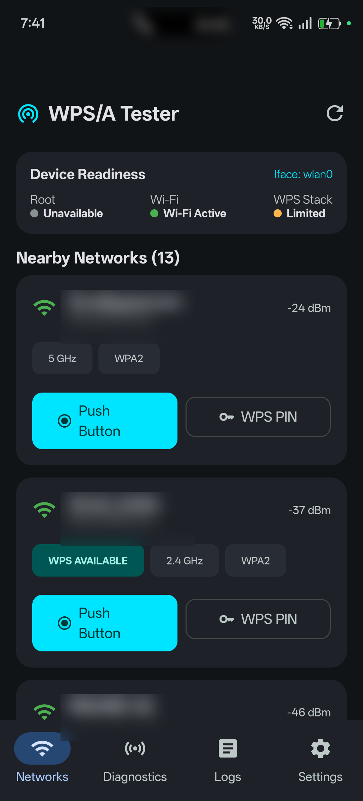
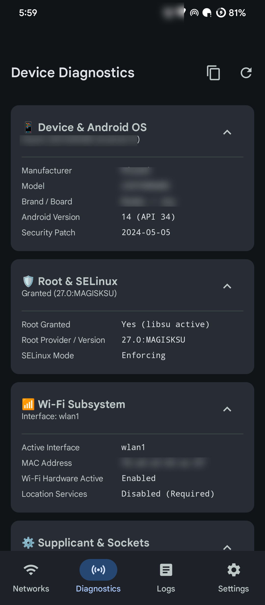
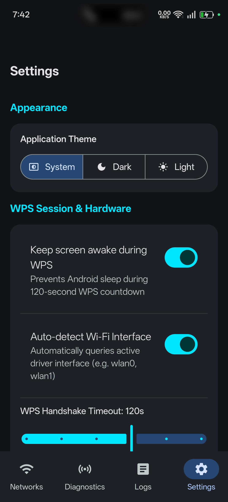
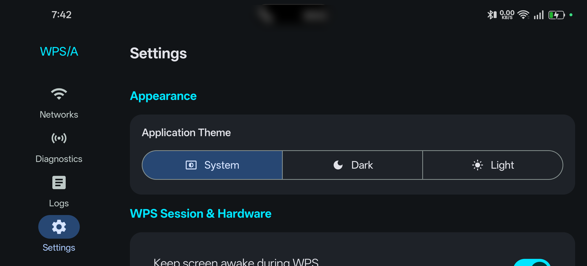

<div align="center">


# WPS/A Tester
### Modern Android Wi-Fi Security Diagnostic & WPS Audit Utility

[](LICENSE)
[-green.svg)](https://developer.android.com)
[](https://kotlinlang.org)
[](https://developer.android.com/jetpack/compose)
[](https://developer.android.com/topic/architecture)
[](PRIVACY_POLICY.md)
[](TERMS_AND_CONDITIONS.md)

<p align="center">
  <b>WPS/A Tester</b> is a high-performance, open-source Android security diagnostic utility engineered natively with <b>Jetpack Compose</b> and <b>Material 3</b>. It is designed specifically for system administrators, network engineers, and security researchers to audit Wi-Fi Protected Setup (WPS) implementations, verify router push-button configurations, and diagnose low-level wireless networking subsystems on modern rooted Android devices.
</p>

[Key Features](#-full-features--functions) • [Screenshots](#-visual-walkthrough--screenshots) • [Legal Warning](#-strict-warning--legal-disclaimer) • [Privacy Policy](#-privacy-policy--terms-and-conditions) • [Building](#-building-from-source) • [Attribution](#-license--attribution)

</div>

---

# ⚠️ STRICT WARNING & LEGAL DISCLAIMER

> ### 🛑 CRITICAL NOTICE: AUTHORIZED TESTING & EVALUATION PURPOSES ONLY
>
> **WPS/A Tester is intended solely and strictly for testing Wi-Fi network security, evaluating router WPS configuration weaknesses, and conducting authorized administrative diagnostics.**
>
> **YOU MAY ONLY USE THIS APPLICATION ON WIRELESS NETWORKS AND CLIENT HARDWARE THAT YOU PERSONALLY OWN OR FOR WHICH YOU HAVE OBTAINED FORMAL, EXPLICIT, WRITTEN AUTHORIZATION FROM THE RIGHTFUL OWNER.**
>
> Auditing, interacting with, or attempting authentication handshakes against third-party wireless infrastructure without authorization is strictly prohibited and constitutes a criminal offense under computer crime legislation, including:
> - **United States**: The Computer Fraud and Abuse Act (CFAA), 18 U.S.C. § 1030
> - **United Kingdom**: The Computer Misuse Act 1990
> - **European Union**: Directive 2013/40/EU on attacks against information systems
> - **International**: Applicable local, municipal, national, and international cybersecurity laws
>
> **Violators are subject to severe civil liability and criminal penalties, including substantial monetary fines and imprisonment.**
>
> The developers, contributors, and copyright holders of this project **expressly disclaim all liability** for damages, system downtime, network disruption, or legal consequences resulting from the use or misuse of this software.
>
> For full legal terms, consult [TERMS_AND_CONDITIONS.md](TERMS_AND_CONDITIONS.md).

---

## 🎯 Sole Purpose: Wi-Fi Security Testing & Diagnostics

To prevent misuse and adhere to ethical security practices, **WPS/A Tester is strictly limited in scope**:

| What WPS/A Tester IS | What WPS/A Tester IS NOT |
| :--- | :--- |
| ✅ **An Administrative Wi-Fi Diagnostic Tool** | ❌ **A Wi-Fi Password Cracking Tool** |
| ✅ **A WPS Push Button (PBC) Implementation Tester** | ❌ **A Brute-Force or Dictionary Attack Engine** |
| ✅ **A Supplicant Socket & Driver Diagnostic Suite** | ❌ **A Pixie Dust or WCF Attack Tool** |
| ✅ **A Multi-Tier Spectrum & Signal Analyzer** | ❌ **A Default PIN Database or Backdoor Generator** |
| ✅ **A 100% Offline, Privacy-Preserving Utility** | ❌ **A Credential Harvesting or Exfiltration Tool** |

---

## 📸 Visual Walkthrough & Screenshots

> [!NOTE]
> **Privacy Sanitization Notice**: In accordance with privacy and security requirements, all sensitive data—including real-world Network Names (SSIDs), hardware MAC addresses (BSSIDs), specific mobile device hardware serials, and carrier calling indicators—have been **blurred and redacted** in the demonstration captures below.

<div align="center">

| Real-Time Wi-Fi Spectrum Scanner | Deep Root & Hardware Diagnostics |
| :---: | :---: |
|  |  |
| *Real-time multi-band AP discovery with signal dBm, frequency badges, and sanitized SSIDs.* | *SELinux status, Magisk/KernelSU root environment, supplicant sockets, and interface audits.* |

| Material 3 Settings & Compliance | Adaptive Landscape / Tablet View |
| :---: | :---: |
|  |  |
| *Appearance preferences, scan sliders, timeout configurations, and in-app legal dialogs.* | *Adaptive Material 3 NavigationRail responsive layout for landscape phones and tablets.* |

</div>

---

## ⚡ Full Features & Functions

### 1. 🔍 Multi-Tier Wi-Fi Spectrum Scanner
Modern Android OS versions impose aggressive background scan throttling. WPS/A Tester overcomes these limitations via an intelligent multi-stage scanning pipeline:
- **Hybrid Discovery Engine**:
  - Primary: Framework `WifiManager.startScan()` with broadcast receivers.
  - Secondary: Fallback root shell scanning using `cmd wifi list-scan-results`.
  - Supplicant-Level: Direct query execution via `wpa_cli scan_results`.
- **Tri-Band Spectrum Support**: Full classification of 2.4 GHz, 5 GHz, and 6 GHz (Wi-Fi 6E/7) channels.
- **Detailed RF Metrics**: Live signal strength in dBm, qualitative reception indicators, and security protocol profiling (Open, WEP, WPA, WPA2, WPA3).
- **WPS Capability Flags**: Instant identification of access points advertising WPS support, locked states, or disabled configurations.
- **Configurable Scan Intervals**: Adjustable continuous scan intervals (5 to 60 seconds) with an optional "WPS Networks Only" filter.

---

### 2. 🔘 WPS Push Button Configuration (PBC) Testing
Modern Android (Android 9 Pie through Android 16) removed native user-facing WPS settings. WPS/A Tester provides administrators with direct supplicant control to test router push-button behavior:
- **120-Second Association Window**: Real-time visual countdown tracking the standard Wi-Fi Alliance WPS PBC negotiation window.
- **Dynamic State Machine Progression**:
  $$\text{Idle} \longrightarrow \text{Preparing} \longrightarrow \text{Waiting for Router} \longrightarrow \text{Authenticating} \longrightarrow \text{Associating} \longrightarrow \text{Obtaining IP} \longrightarrow \text{Connected}$$
- **Direct Supplicant Handshake**: Commands `wpa_cli -i <iface> wps_pbc <bssid>` directly through root-authenticated sockets.
- **Graceful Cancelation & Rollback**: Clean teardown of temporary network blocks (`wpa_cli remove_network`) if canceled or timed out.
- **Screen WakeLock Guard**: Prevents mobile device sleep states during active 2-minute WPS handshakes.

---

### 3. 🔢 WPS PIN Authentication Verification
Allows network owners to verify whether an access point correctly handles or rejects authorized PIN inputs:
- **Local Checksum Validation**: Client-side Luhn-derived checksum algorithm validation for standard 8-digit and 4-digit PIN structures prior to execution.
- **Sanitized Execution**: All PIN parameters undergo strict regex sanitization (`^[0-9]{4,8}$`) to prevent shell injection vulnerabilities.
- **Rate-Limiting & Lockout Auditing**: Confirms whether the router locks out subsequent attempts after incorrect PIN entries or responds to standard M1–M8 EAP-WSC frames.
- **Zero PIN Backdoors**: Does **not** include pre-computed dictionary tables or automated brute-forcing.

---

### 4. 🛡️ Deep Root & Hardware Diagnostics Engine
A complete environment audit suite verifying low-level device readiness:
- **Operating System & Kernel**: Detailed inspection of Android release version, API level, build fingerprint, and kernel release.
- **SELinux Enforcement Audit**: Queries kernel SELinux status (`getenforce`) to confirm whether the device operates in `Enforcing` or `Permissive` mode.
- **Root Provider Detection**: Identifies the active superuser provider (Magisk, KernelSU, APatch, or standard su) and validates `libsu` IPC daemon state.
- **Wi-Fi Interface Binding**: Inspects active wireless interfaces (`wlan0`, `wlan1`, `p2p0`) via `iw dev` and `ip link`.
- **Supplicant Socket Verification**: Checks socket presence and accessibility across `/data/misc/wifi/sockets/` and `/dev/socket/wpa_wlan0`.
- **Command Tool Availability**: Audits the presence of essential Linux networking binaries (`iw`, `ip`, `wpa_cli`, `getenforce`).
- **One-Tap Diagnostic Export**: Copies a comprehensive markdown environment audit report directly to the system clipboard.

---

### 5. 📜 In-Memory Bounded Live Event Logger
High-efficiency, privacy-preserving logging designed for diagnostic analysis:
- **Bounded Circular Ring Buffer**: Limits in-memory logs to 1,000 entries to ensure zero garbage collection stutter and zero disk bloat.
- **Severity Filtering**: Live filtering by log level (`ALL`, `DEBUG`, `INFO`, `WARN`, `ERROR`).
- **Real-Time Search**: Instant regex and text search across captured log lines.
- **Credential & PIN Masking**: In-memory regex redaction automatically censors PINs (`[REDACTED_PIN]`), passwords, and sensitive tokens.
- **Zero-Flicker Autoscroll**: Toggleable autoscroll pinned to the latest event stream.
- **Export Capabilities**: One-tap export to clipboard for administrative troubleshooting.

---

### 6. 🎨 Modern Material 3 UI/UX & Adaptive Layouts
Engineered natively with Jetpack Compose following Google's latest Material You specifications:
- **Adaptive Window Size Classes**:
  - *Portrait (Phones)*: Bottom `NavigationBar` with haptic feedback.
  - *Landscape / Tablets*: Side `NavigationRail` maximizing vertical screen real estate.
- **Dynamic Theming**: Full support for System Default, Dark Mode (optimized for OLED power savings), and Light Mode.
- **Haptic Feedback**: Subtly communicates scan updates and connection state changes.

---

### 7. 🔒 100% Offline & Privacy-First Architecture
WPS/A Tester is built with a zero-trust privacy posture:
- **Zero Telemetry**: No analytics libraries (Google Analytics, Firebase), no crash reporting platforms, and no remote servers.
- **Zero Internet Permissions**: The app does not request or require remote internet access; it functions 100% locally.
- **Volatile Storage**: Scanned Wi-Fi data and diagnostic events are held strictly in RAM and cleared immediately when the app exits.

---

## 🔐 Privacy Policy & Terms and Conditions

WPS/A Tester maintains complete transparency regarding its security and privacy standards.

### In-App Access
Both documents are accessible directly inside the application:
1. Open **Settings** (gear icon in the navigation bar or rail).
2. Scroll to the **Legal & Compliance** section.
3. Tap **Privacy Policy** to view the offline and zero-telemetry policy dialog.
4. Tap **Terms & Conditions** to view the authorized testing agreement and liability disclaimers.

### Repository Documents
Full legal texts are included in the repository root:
- 📄 [PRIVACY_POLICY.md](PRIVACY_POLICY.md) — Comprehensive offline policy, permission justifications, and memory management.
- 📄 [TERMS_AND_CONDITIONS.md](TERMS_AND_CONDITIONS.md) — Terms of use, authorized testing restrictions, CFAA warning, and AGPL-3.0 disclaimers.

---

## 📱 System Requirements

| Parameter | Specification | Note |
| :--- | :--- | :--- |
| **Android OS** | Android 7.0 (API 24) to Android 16 (API 36) | Broad compatibility across 10 major Android versions |
| **Superuser (Root)** | Magisk v25+, KernelSU, or APatch | Required for `wpa_supplicant` socket interaction |
| **Wi-Fi Hardware** | SoC supporting managed mode | Qualcomm, MediaTek, Samsung Exynos, Broadcom |
| **Internet Access** | **None (100% Offline)** | Zero network egress required |

---

## 🛡️ Android Permissions Breakdown

| Permission | Type | Technical Justification |
| :--- | :--- | :--- |
| `ACCESS_FINE_LOCATION` | Runtime | Mandated by Android 8–12 for apps performing Wi-Fi discovery scans. (No GPS data is logged). |
| `ACCESS_COARSE_LOCATION`| Runtime | Fallback location permission for access point discovery. |
| `NEARBY_WIFI_DEVICES` | Runtime | Mandated on Android 13+ (API 33+) to discover local Wi-Fi devices without location access. |
| `ACCESS_SUPERUSER` | Special | Declares root interaction to management apps (Magisk/KernelSU) for `wpa_cli` execution. |
| `WAKE_LOCK` | Normal | Prevents CPU sleep during the 120-second WPS Push Button negotiation timer. |
| `VIBRATE` | Normal | Haptic confirmation for scan completion and state changes. |

---

## 🏗️ Building from Source

### Prerequisites
- **JDK**: Java Development Kit 17 or 21
- **Android SDK**: Platforms up to Android 16 (API 36)
- **Build-Tools**: 36.0.0
- **Gradle**: 9.6.1+ (via included wrapper `./gradlew`)

### Build Steps

```bash
# 1. Clone the repository
git clone https://github.com/fulvius31/wifi-wps-wpa-tester-opensource.git
cd wifi-wps-wpa-tester-opensource

# 2. Run automated unit test suite (24/24 passing)
./gradlew test --no-daemon

# 3. Build debug APK
./gradlew assembleOpenDebug --no-daemon

# 4. Build signed production release APK
./gradlew assembleOpenRelease --no-daemon
```

### Verified Release Artifacts
- **Package Name**: `com.wpsa.tester`
- **Output Path**: `app/build/outputs/apk/open/release/app-open-release.apk`
- **Distribution Package**: `apk_artifacts/WPS-A-Tester-v1.0.0.apk`
- **Cryptographic Verification**:
  ```powershell
  apksigner verify --verbose --print-certs apk_artifacts/WPS-A-Tester-v1.0.0.apk
  ```

---

## 📜 License & Attribution

This project is licensed under the **GNU Affero General Public License, Version 3.0 (AGPL-3.0)** — see the [LICENSE](LICENSE) file for the complete license text.

### Upstream Attribution
- **Original Project Name**: WiFi WPS WPA Tester - Open Source
- **Original Author & Copyright Holder**: **Alessandro Sangiorgi**
- **Original Repository**: [https://github.com/fulvius31/wifi-wps-wpa-tester-opensource](https://github.com/fulvius31/wifi-wps-wpa-tester-opensource)
- **Original Concept**: Inspired by the original *WIFI WPS WPA TESTER* utility created by Alessandro Sangiorgi.

### Open-Source Acknowledgments
- **[libsu](https://github.com/topjohnwu/libsu)** by John Wu (topjohnwu) — Apache License 2.0 (Superuser shell abstraction)
- **[Android Jetpack & Compose](https://developer.android.com/jetpack)** by Google LLC — Apache License 2.0
- **[Dagger Hilt](https://dagger.dev/hilt/)** by Google LLC — Apache License 2.0
- **[Kotlin Coroutines](https://github.com/Kotlin/kotlinx.coroutines)** by JetBrains s.r.o. — Apache License 2.0
- **[wpa_supplicant](https://w1.fi/wpa_supplicant/)** by Jouni Malinen — BSD License
